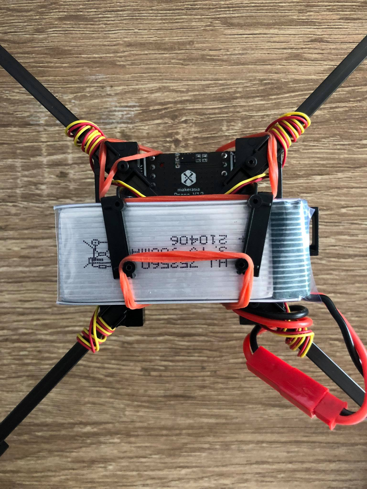

# Manual Drone Kit

## **คู่มือการประกอบ Drone Kit KB32-FT**

### **รายการสินค้าที่ท่านจะได้รับในชุด Drone Kit KB32-FT**

### **ถุงบรรจุสินค้าแรกจะประกอบด้วย**

1. **บอร์ด KB32-FT x 1 บอร์ด**
2. **บอร์ด Breakout สำหรับขับมอเตอร์ KB32-FT Drone x 1 บอร์ด**
3. **มอเตอร์โดรน x 4 ชุด** 
4. **ใบพัด สีขาว x 2 ใบ สีดำ x 2 ใบ**
5. **ชุดตัวโดรน x 1 ชุด**
6. **ใบรายการสินค้า x 1 ใบ**

### **ถุงบรรจุสินค้าสองจะประกอบด้วย**

1. **สาย รับ-ส่ง ข้อมูล Micro USB x 1 เส้น**
2. **พวงกุญแจคล้องสาย x 1 เส้น**
3. **แบตเตอรี่ ลิเธียมโพลิเมอร์ 3.7V 900mAh x 1 ก้อน**
4. **หัวชาร์จ แบตเตอรี่ ลิเธียมโพลิเมอร์ 3.7V x 1 ชุด**

### **ภาพตัวอย่างสินค้าที่ท่านจะได้รับทั้งหมด**

## **วิธีการประกอบ Drone Kit KB32-FT**

### **ขั้นตอนที่ 1**

* **ให้นำชุดโดรนวางคว่ำหน้า และให้มองเห็นเฟืองมอเตอร์ ดังภาพตัวอย่างวงกลมที่ 1 หลังจากนั้นให้นำชุดขาใบพัด สอดเข้ากับลำตัวโดรน ดังภาพตัวอย่างวงกลมที่ 2 โดยให้ทำทั้งหมด 4 ด้านขาใบพัด** 


**ข้อควรระวัง ระวังชุดขาใบพัดทับเส้นสายไฟ**


### **ขั้นตอนที่ 2**

* **หลังจากนำขาใบพัดทั้ง 4 ด้าน สอดเข้ากับตัวโดรนแล้ว ให้ดันขาใบพัดเข้าไปให้สุดดังภาพตัวอย่างวงกลมที่ 1 ให้ทำทั้งหมดแบบเดียวกันทั้ง 4 ด้านขาใบพัด**


**ข้อควรระวัง ระวังชุดขาใบพัดทับเส้นสายไฟ**


### **ขั้นตอนที่ 3**

* **นำสายไฟมอเตอร์ สอดลงมุมด้านในตัวโดรน ดังภาพตัวอย่างวงกลมที่ 1 โดยให้ทำทั้งหมดแบบเดียวกันทั้ง 4 ด้าน**

* **หลังจากนั้นให้ทำการพันสายไฟรอบขาใบพัด จำนวน 3-4 รอบ**

* **หลังจากทำการพันสายไฟแล้ว ให้นำหัวสายไฟต่อเข้ากับบอร์ดขับมอเตอร์ โดยให้ทำทั้งหมดแบบเดียวกันทั้ง 4 ด้าน \(ข้อควรระวัง ให้ต่อหัวสายไฟเข้ากับด้านขาของบอร์ดขับมอเตอร์ ตามมุมตรงกับขาใบพัดเท่านั้น\)**

* **ข้อสังเกต สายไฟต้องไม่สูงกว่า หรือเท่ากับใบพัด และสายไฟต้องไม่ตรึงเกินเพื่อป้องกันขั้วสายไฟขาด**

### **ขั้นตอนที่ 4**

* **ให้นำบอร์ด KB32-FT มาประกบเข้ากับด้านบนบอร์ดขับมอเตอร์ โดยให้ขาตรงกับช่องเสียบพอดี**

**ขั้นตอนที่ 5**

* **ให้นำแบตเตอรี่ใส่ด้านล่างของลำตัวโดรนดังภาพตัวอย่าง และใช้หนังยางรัดแบตเตอรี่ตามสะดวก**


**ข้อควรระวัง ให้ต่อสายไฟแบตเตอรี่ สีตรงกันกับสีหัวเสียบเท่านั้น**


**ขั้นตอนที่ 6**

* **ตำแหน่งใบพัด Drone  ใบพัดสีขาวคือตำแหน่งด้านหน้า และตรวจสอบ Label  A และ B** 

## **ภาพตัวอย่าง Drone Kit KB32-FT หลังประกอบเสร็จ**

